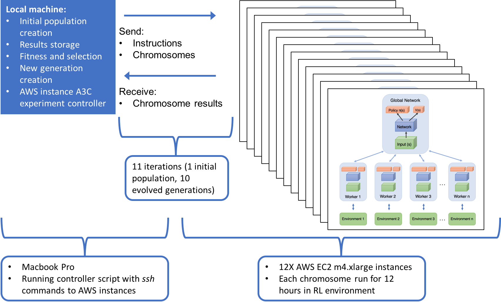
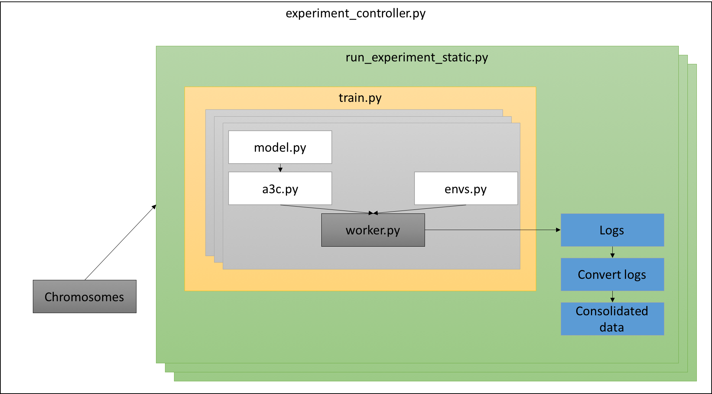

# Description

These are the critical files needed when running the experiment for my Master of Science dissertation at The University of Cape Town.

The experiment runs a set number of generations of chromosomes involved in learning the game of Atari Pong via A3C reinfrocement learning. Each chromosome represents the the neural network that is updated as part of policy approximation. The goal is to find neural networks that perform well on some stated fitness metric - in this case, a weighted average of best EMA on the task, noise, and time per episode.

The first generation of chromosomes is created by running genesis.py, thereafter the full experiment is run with experiment_controller.py which runs run_experiment_static.py on each instance.

# How to run it

Before running anything, the best thing to do is to understand the parameters you want to adjust in the code - e.g. the number of workers per A3C experiment.

The general order for running the dissertation experiment was:

1. Run `genesis.py` in order to create an initial population of chromosomes. Adjust the amount of chromosomes created here.
2. Set up your AWS spot instances. Create an AMI (see below) that you can use for these spot instances, then bulk create the number of instances needed in the AWS control panel.
3. Update the instance addresses and your `.pem` file in the `experiment_controller.py` file. This script will control the multiple generatios across all the instances.
4. `python experiment_controller.py` will start the full experiment. Each instance running an A3C experiment will have an available Tensorboard that you can access from your browser if you have the right security settings on your instances. See the A3C output in an instance to check the address.

## How the pieces fit together

There are several python files in the experiment, with a system between the files inspired by the OpenAI work, but extended to allow for chromosomes, generations, and parallel experiments. The `experiment_controller.py` file runs the entire experiment, but it begins the `run_experiment_static.py` within each instance (and within a tmux shell within that instance). This file in turn runs `train.py` which begins an individual A3C experiment and deploys the specified number of workers (`worker.py`), who use the chromosome in `model.py` and the environment in `env.py`. The experiment is logging all key events with Tensorboard, the files of which are then being sent back to the local machine running `experiment_controller.py`. These log files allow for fitness calculations and the running of `new_generation.py` which creates the chromosomes used in the next generation deployed automatically by `experiment_controller.py`.

## AMI setup

Getting original OpenAI agent to run was challenging - the instructions given did not work, and there were some extra modules that needed to be installed. The code in this repo has several more dependencies too, and was challenging to get working on a fresh instance. The instructions below worked, but it is possible that there might be a few more tweaks needed.

After creating an instance with the "Ubuntu Deep Learning AMI v20":

1. `source activate tensorflow_p36`
2. `pip install --upgrade pip`
3. `sudo apt-get install -y tmux htop cmake golang libjpeg-dev`
4. `pip install "gym[atari]"``
5. `pip install universe` (seemed to work although 2x docker dependency issues)
6. `pip install six` (req satisfied)
7. `conda install -y -c https://conda.binstar.org/menpo opencv3`
8. `conda install tabulate` (went ahead, although it downgraded a few things)
9. `pip install tflearn`
10. I checked to make sure tensorflow and keras were installed (1.12.0 and 2.2.4 respectively)
11. `mkdir evorl`
12. `cd evorl`
13. `mkdir output`

# Future enhancements
